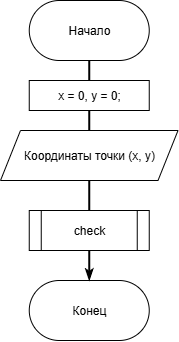
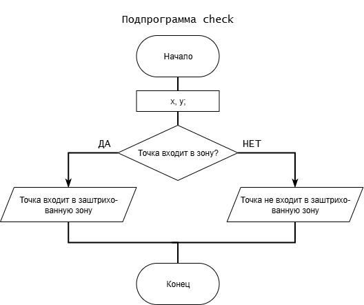

# Домашнее задание к работе 6

### Условие:

Составить программу, которая проверяет принадлежит ли заданная пользователем точка с координатами (х, у) заданным закрашенным (заштрихованным) областям, показанным на рисунках в табл., и выводит на экран сообщение.   

### Алгоритм:
1. Начало      
2. Объявить переменные;        
	`double x = 0, y = 0;`    
3. Считать введённый вес игрушек;      
	`scanf("%lf %lf", &x, &y);`       
4. Составляем условие для проверки вхождения точки в заштрихованную область, а также выводим результат;  
    `if ((y >= 0) && (x >= 0) && (y <= (4 - x * x)) && (x <= (4 - y * y)) && (y >= x))
	 {
	 	 printf("Ваша точка (%.1lf, %.1lf) принадлежит заштрихованному полю!\n", x, y);
	 }
	 else {
		 printf("Ваша точка (%.1lf, %.1lf) не принадлежит заштрихованному полю!\n", x, y);
	 }`     
5. Конец.    

### Блок-схема:





## 2. Реализация программы 

```
#include <stdio.h>
#include <stdlib.h>
#include <math.h>
#include <locale.h>
#define _USE_MATH_DEFINES
void check();

int main()
{ // вариант 7 (9%33+1)            Задание "типо" для продивинутых
	setlocale(LC_ALL, "RUS");

	double x = 0, y = 0;

	puts("В декартовой системе координат проведён полукруг и линия.");
	puts("Введите координаты случайной точки \"х y\", чтобы проверить");
	puts("входит ли она в заштрихованное поле ");
	puts("(формат - два числа через пробел, сначала X, потом Y): ");

	scanf("%lf %lf", &x, &y);

	check(x, y);

	// создал отдельный метод, чтобы проще было проверить на числах (заново вводить их постоянно не хочу)

	puts("\nПеречень точек для проверки:");
	check(0., 1.); // подходят
	check(0., 2.);
	check(1., 1.);
	check(0.5, 1.);
	check(0.5, 1.5); 

	check(2., 3.); // не подходят
	check(-1., 1.);
	check(1., -1.);
	check(3., -2.);
	check(2.1, 2.1);

	return 0;
}

void check(double x, double y)
{
	/* 1. (y >= 0) && (x >= 0) - отрубаем по осям
	   2. (y <= (4 - x * x)) и (x <= (4 - y * y)) - заштрихованная зона находится внутри окружности, поэтому координаты точки x y
											      должны быть меньше или равны, чем координаты точки на окружности
	   3. (y >= x) - заштрихованная зона находится над линией, поэтому y больше или равен x 
	*/

	if ((y >= 0) && (x >= 0) && (y <= (4 - x * x)) && (x <= (4 - y * y)) && (y >= x))
	{
		printf("Точка (%.1lf, %.1lf) принадлежит заштрихованному полю!\n", x, y);
	}
	else {
		printf("Точка (%.1lf, %.1lf) не принадлежит заштрихованному полю!\n", x, y);
	}
}
```

## 3. Результаты работы программы

В декартовой системе координат проведён полукруг и линия.    
Введите координаты случайной точки "х y", чтобы проверить    
входит ли она в заштрихованное поле    
(формат - два числа через пробел, сначала X, потом Y):    
0 1    
Точка (0,0, 1,0) принадлежит заштрихованному полю!    
    
Перечень точек для проверки:    
Точка (0,0, 1,0) принадлежит заштрихованному полю!    
Точка (0,0, 2,0) принадлежит заштрихованному полю!    
Точка (1,0, 1,0) принадлежит заштрихованному полю!    
Точка (0,5, 1,0) принадлежит заштрихованному полю!    
Точка (0,5, 1,5) принадлежит заштрихованному полю!    
Точка (2,0, 3,0) не принадлежит заштрихованному полю!    
Точка (-1,0, 1,0) не принадлежит заштрихованному полю!    
Точка (1,0, -1,0) не принадлежит заштрихованному полю!            
Точка (3,0, -2,0) не принадлежит заштрихованному полю!            
Точка (2,1, 2,1) не принадлежит заштрихованному полю!                     
    
## 4. Информация о разработчике

Кравченко В.В. бИЦ-251